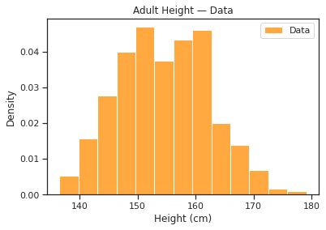
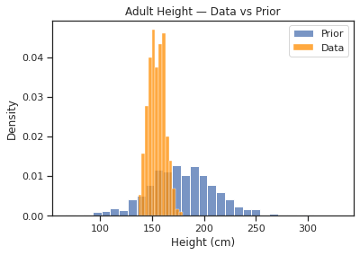
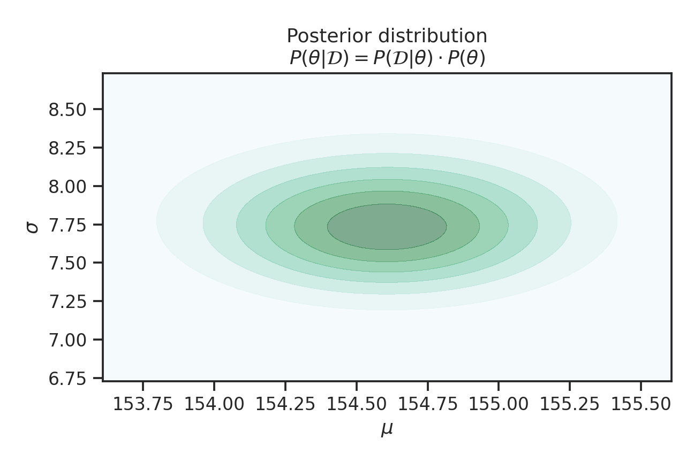

I'm calling this a "deep dive" because we're going to go through many steps as we solve this problem. Many of these steps are intermediary and usually glossed over or stated as fact in other explanations of this topic. This post is most suited to those who are doing interview preparation or who want a detailed understand of the topic.

Topics covered:
* Multivariate Gaussian Distribution $N(\mu, \Sigma)$
* Gradient Decent to find the *maximum a posteriori* (MAP)
* Quadratic Approximation (aka Laplace Approximation)
* Taylor Expansion
* Covariance Matrix $\Sigma$ and it's inverse $\Sigma^{-1}$
* The Hessian $\mathcal{H}$ and it's relationship to $\Sigma^{-1}$
* Empirical (tabular) estimation of second partial derivatives
* Errors associated with the Gaussian assumption

[Companion Colab Notebook](https://colab.research.google.com/drive/1REwGPMOk_elQcalsqhKzqQ3WYizB_T37?usp=sharing)

{}

## Preamble

Richard McElreath does a great job of explaining the topics of Probabilistic Modeling and Bayesian Inference. This post is based on the problem he uses in Chapter 4 of Statistical Rethinking. In particular, this post is about what happens when a single line of code is called 

```python
result = maximum_a_posteriori(model, data=df)
``` 

It turns out there is a lot happening behind the scene here and we're going to cover it.

## Problem setup

The setup is simple, we want to use a Gaussian to describe the distribution of !Kung adult heights. The data provided by Richard is partial census data from where they live, which is near the Kalahari Desert in the southern part of Africa. 

### Data

The data contains a mix of adults and children. Filtering it to those with an age of at least 18 leaves us with 352 data points. Inspecting the histogram shows that the data is roughly Gaussian.



### Model

The first model that Richard has us use is a Gaussian with priors on both of it's parameters.

$$
\begin{aligned}
h_i &\sim N(\mu, \sigma) \\\\
\mu &\sim N(178, 20) \\\\
\sigma &\sim U(0, 50)
\end{aligned}
$$

From the data and what we know about the world, a mean height prior of `178` is a bit high. However, the flexibility provided by the standard deviation of `20` means that the model can still fit our data. It's also useful for illustrating how data can overcome incorrect priors so long as they are not too strong. We double check that our model is capable of describing the data by plotting samples from it's prior distribution. 



## Find MAP estimate of parameters

TODO

{}
The mode of a distribution is its *maximum a posteriori* which translates to *maximum of the posterior*.
{}


## Quadratic approximation of parameter distributions

Now that we have found the mode of the posterior distribution, we can use quadratic approximation to estimate the marginal distribution of our models parameters. 

Let's go over what we have so far. The posterior of our model is a Gaussian model of height, $h \sim N(\mu, \sigma)$. Using gradient decent, we've found that using values $\mu = 154.60$ and $\sigma = 7.73$ maximizes the probability of the data subject to our priors. This gives us a point estimate of our parameters $\theta = \{\mu, \sigma \}$. Now let's find each parameters marginal distribution.

### Parameter distributions

Before calculating the marginal distributions, let's take a look at the joint distribution of $\theta$.




