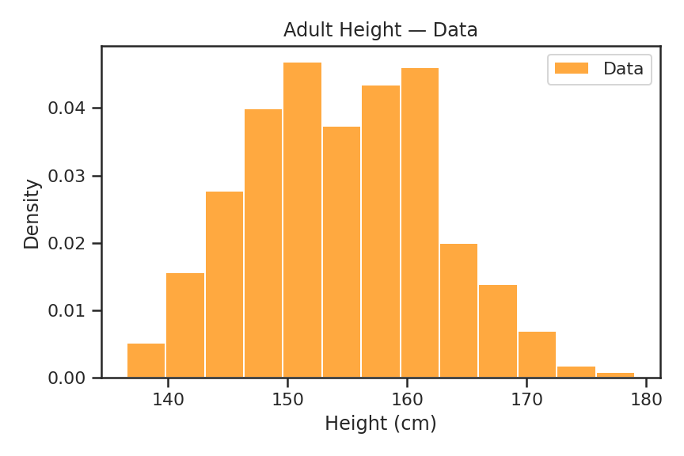
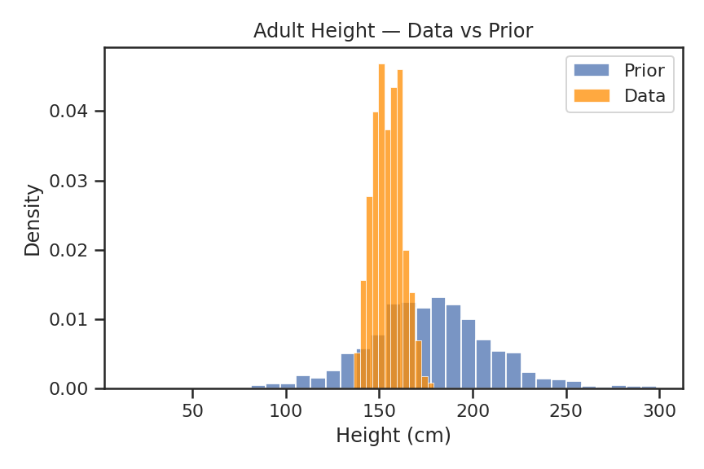
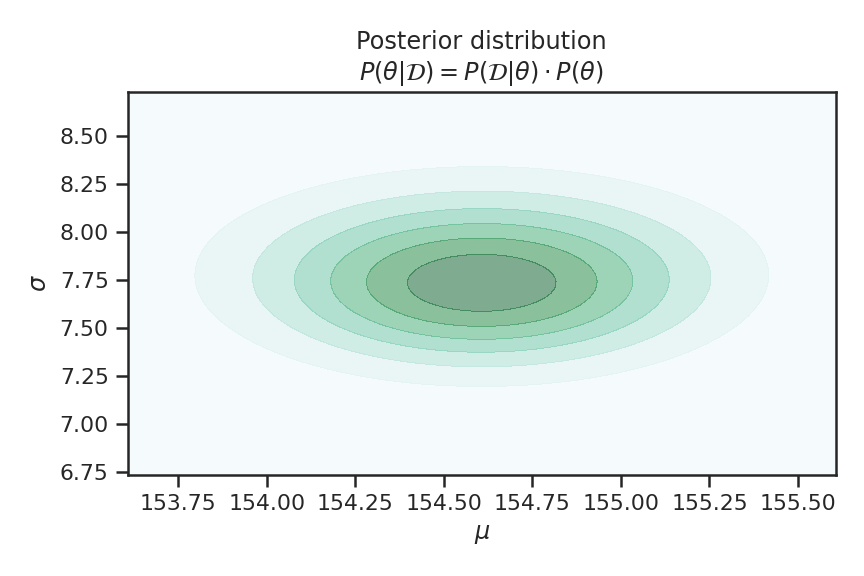

This is an in depth post about Bayesian probabilistic modeling. I'm using a model because it enables us to go through every step in detail. Many mathematical techniques are used to solve this problem. Since this is a deep dive, I'll be reviewing these topics as well. This post is aimed at those who want a detailed understand of the topic or who are preparing for interviews.

<!-- Topics covered:
* Multivariate Gaussian
* MAP - *maximum a posteriori* 
* Gradient Decent
* Taylor Expansion
* Inverse of Covariance Matrix
* Hessian of Multivariate Gaussian
* Empirical second partial derivatives
* Quadratic Approximation
* Goodness of fit testing -->

I've also prepared a self-contained IPython notebook that reproduces the results of this post.

[Companion Colab Notebook](https://colab.research.google.com/drive/1REwGPMOk_elQcalsqhKzqQ3WYizB_T37?usp=sharing)

{}

## Probabilistic modeling

Briefly, let's go through the modeling thought process. I find Jaynes' formulation of probability theory particularly useful. He extends mathematical logic (Boolean algebra) to the continuous space. So rather than propositions being true `1` or false `0`, they have a degree of _plausibility_ `[0, 1]`. This formulation is naturally Bayesian because it is based on uncertainty rather than random chance. One of the benefits of viewing probability from this lense is that it enables the following empirical modeling thought process.

### Steps

1. There is some phenomena $p \in \mathcal{P}$ 
1. Our goal $g \in \mathcal{G}$ is to understand, predict, or describe $p$
1. We can obtain data $d \in \mathcal{D}$ that represents our phenomena and goal
1. We produce a model $m \in \mathcal{M}$ that can adequately handle the data
1. We find model parameters $\theta \in \Theta$ that best accomplishes our goal
   * when $m$ is non-parametric the data are the parameters $d = \theta$

TODO: These decisions happen in this order. Each of these decisions restricts the search space. Each decision has a probability of being non-optimal or even wrong. I'd like to show both the space reduction (probably set notation) and the cumulative uncertainty effect of decisions 1 - 4 on the results we get from 5. Basically, what is the impact of $P(\mathcal{M}) < 1$? 

We'd like to select each of these components to maximize the probability of us achieving our goal. To put it formally we are looking for

$$
\underset{d, m, \theta}{arg\max}\ P(\mathcal{D} = d, \mathcal{M} = m, \Theta = \theta | p, g)
$$

Although it's true that $p$ may not exist and $g$ may be the wrong goal, at some point we make the decision to proceed with our modeling process. To make the notation less cluttered we implicitly condition on these two elements. This means we are left with the joint distribution

$$
\tag{1}
P(\mathcal{D}, \mathcal{M}, \Theta)
$$

which will be important to remember as we proceed.

## Problem setup

Richard McElreath does a great job of explaining the topics of Probabilistic Modeling and Bayesian Inference. The problem we are going to cover is in Chapter 4 of Statistical Rethinking, which is to describe the distribution of !Kung adult heights. In particular, we're going to manually do what is accomplished from this line of code in the text

```python
result = maximum_a_posteriori(model, data=df)
``` 

It turns out there is a lot happening behind the scene here.

### Data

The data provided by Richard is partial census data from where the !Kung people live, which is near the Kalahari Desert in the southern part of Africa. The data contains a mix of adults and children. Filtering it to those with an age of at least 18 leaves us with 352 data points. Inspecting the histogram shows that the data is roughly Gaussian.



**Modeling decision:** $\mathcal{D} = d$ here we've decided to use the data provided to us.

### Model

The first model that Richard has us use is a Gaussian with priors on both of it's parameters.

$$
\tag{2}
\begin{aligned}
h_i &\sim N(\mu, \sigma) \\\\
\mu &\sim N(178, 20) \\\\
\sigma &\sim U(0, 50)
\end{aligned}
$$

From the data and what we know about the world, a mean height prior of `178` is a bit high. However, the flexibility provided by the standard deviation of `20` means that the model can still fit our data. It's also useful for illustrating how data can overcome incorrect priors so long as they are not too strong. We double check that our model is capable of describing the data by plotting samples from its prior distribution. 



**Modeling decision:** $\mathcal{M} = N(\mu, \sigma)$ and $\Theta = \{\mu, \sigma\}$ here we've decided to use a Gaussian model and to impose priors on it's parameters.

## Posterior

At this point, for better or worse, we've decided on [steps](#Steps) 1 - 4. Meaning we've made decisions on the data, model, and set of parameters we are going to consider when describing the height of the !Kung people. This reduces the space of our joint distribution in equation (1) to

$$
\tag{3}
P(d, m, \theta)
$$

Step 5, the final step, is to select the parameters we use with our model. To do this, we need to isolate $\theta$ in equation (3). Using the [rules of probability](https://en.wikipedia.org/wiki/Joint_probability_distribution#Joint_density_function_or_mass_function), we can rewrite a joint distribution in terms of conditional distributions. The following are all equivalent

$$
\tag{4}
\begin{aligned}
P(d, m, \theta) &= P(m | d, \theta) \cdot P(d, \theta)\\\\
                &= P(d | \theta, m) \cdot P(\theta, m) \\\\
                &= P(\theta | d, m) \cdot P(d, m)
\end{aligned}
$$

and we're going to use the first one so we can get rid of $m$ while we work to isolate $\theta$.

$$
\tag{5}
\begin{aligned}
&P(m | d, \theta) \cdot P(d, \theta) = P(m | d, \theta) \cdot P(d, \theta) \\\\
&P(m | d, \theta) \cdot P(\theta | d) \cdot P(d) = P(m | d, \theta) \cdot P(d | \theta) \cdot P(\theta) \\\\
&\cancel{P(m | d, \theta)} \cdot P(\theta | d) \cdot P(d) = \cancel{P(m | d, \theta)} \cdot P(d | \theta) \cdot P(\theta)\\\\
&P(\theta | d) \cdot P(d) = P(d | \theta) \cdot P(\theta)
\end{aligned}
$$

Dividing both sides by $P(d)$ will isolate $\theta$ and provide us with the formula we associate with "Bayes' rule".

$$
\tag{6}
\overbrace{P(\theta | d)}^\text{Posterior} = \frac{\overbrace{P(d | \theta)}^\text{Likelihood} \cdot \overbrace{P(\theta)}^\text{Prior}}{\underbrace{P(d)}_\text{Space being considered}}
$$

We've just derived the posterior distribution. Just as our data has a distribution, so do the parameters of our model. There are many values our parameters could take on but only a small subset of these make sense given our data and priors. Next, We'll look at finding this subset.

## MAP Estimation

Remember that $P(d) := P(\mathcal{D} = d)$. Now that we've decided on what data to use, this probability is fixed and independent of the parameters $\theta$ we choose. It's for this reason you will sometimes hear $P(d)$ referred to as a _normalizing constant_. Since the maximum of a function does not change when every value is multiplied by a constant value, we can disregard this quantity and arrive at the same conclusion.

$$
\tag{7}
P(\theta | d) = P(d | \theta) \cdot P(\theta)
$$

Plugging our modelling assumptions into equation (7) gives us

$$
\tag{8}
\begin{aligned}
P(\mu, \sigma | d) &= P(d | \mu, \sigma) \cdot P(\mu | \sigma) \cdot P(\sigma) \\\\
                   &= P(d | \mu, \sigma) \cdot P(\mu) \cdot P(\sigma)
\end{aligned}
$$

The reason that $P(\mu | \sigma) = P(\mu)$ is purely due to the parameter independence assumption we made when defining our [model](#model). We'll see later on that this was an incorrect assumption. Our full un-normalized probability function is

TODO: Expand equation (8) to our concrete model.

Now that we know we're trying to optimize the posterior, let's learn a way to do this. There are a few optimization techniques that can be used for this type of problem and I'm going to use the one that's most familiar to me. I come from a deep learning background and we use gradient decent often so this is how I'm going to find the maximum of our posterior distribution. Before we get into this though, we're going to make the function we optimizer easier to deal with.

TODO: Explain the Log transformation.

TODO: Explain gradient decent. This is full batch gradient decent.


{}
The mode of a distribution is its *maximum a posteriori* which translates to *maximum of the posterior*.
{}


## Quadratic approximation

Now that we have found the mode of the posterior distribution, we can use quadratic approximation to estimate the full posterior distribution. Remember that our posterior distribution is a multivariate Gaussian

$$
\begin{aligned}
\mathbf{\theta} &\sim N(\hat{\mathbf{\theta}}, \Sigma) \\\\
&\sim \frac{1}{(2\pi)^{\frac{d}{2}} |\Sigma|^{\frac{1}{2}}}e^{-\frac{1}{2}(\mathbf{\theta} - \hat{\mathbf{\theta}})^\intercal \Sigma^{-1}(\mathbf{\theta} - \hat{\mathbf{\theta}})}
\end{aligned}
$$

and in our case $\mathbf{\theta} := \\{\mu, \sigma\\}$ since these are the two, $d = 2$, parameters of our height model. Using gradient decent, we've found that $\hat{\mu} = 154.60$ and $\hat{\sigma} = 7.73$ which means that $\hat{\mathbf{\theta}} = \\{154.60, 7.73\\}$. What's still unknown to us is the variance of the posterior, $\Sigma$. Let's figure this out now.

### Covariance matrix

First, let's take a look at the empirical posterior joint distribution. This was 



